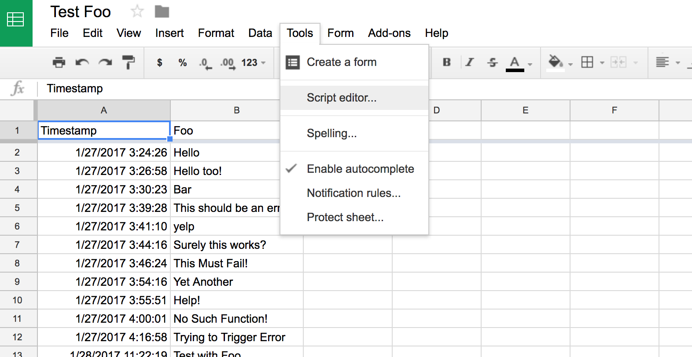
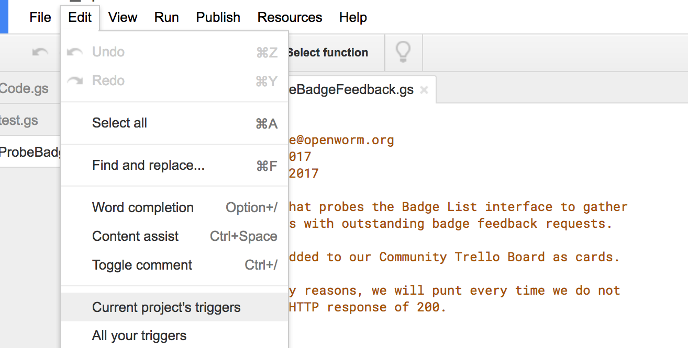
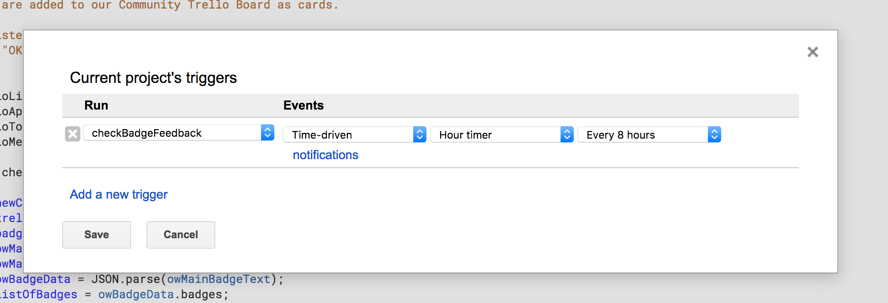

# OpenWorm Community Tools involving Badge List

## Resources

* Badge List service for Open Badges - [https://www.badgelist.com](https://www.badgelist.com)
* OpenWorm on Badge List - [https://www.badgelist.com/OpenWorm](https://www.badgelist.com/OpenWorm)

## Tools

### Outstanding Feedback Tracker with Trello

**_tagFeedbackWithTrello.gs_** - Google Script code that can be
 attached to any Google Document (We used one of our spreadsheets.)
 This script scans our Badge List metadata to determine a list of
 outstanding badge feedback requests that are then compared against
 corresponding cards in an appropriate Trello list managed by us. If a
 feedback request is found to be new, a new card is created for the
 list (a Todo list,) and an alert is sent to one of our Slack chat
 channels (requires some additional set up.)

 Information on using Google Scripts - [https://www.google.com/script/start/](https://www.google.com/script/start/)

 

 We set up a timed Google script trigger to execute the script every 8
 hours. Note that triggers are account-sensitive for Google - even
 though the document (and scripts) may be shared between different
 account, users may not see each other's script triggers.

 

 
